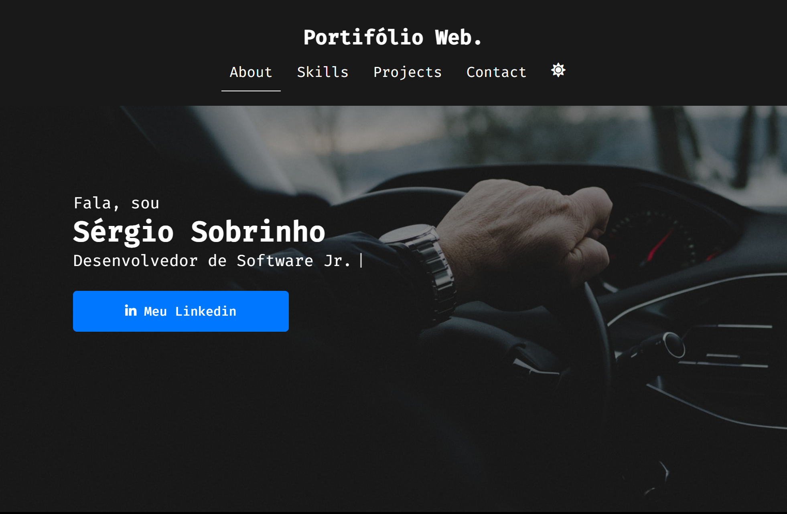

# Portifólio Web 

Trata-se de um Portifólio Web, feito interamente por mim <a href="github.com/sobrinhosergio">Sérgio Sobrinho</a>, com a finalidade de mostrar todas as minhas habilidadesem nas tecnologias, para se ter melhor conhecimento da minha área de atuação que seria o **Full-Stack**, a cada dia eu estou me aprimorando mais. 

## Sobre o projeto

O Projeto conta com várias seções, que tem como função organizar cada parte do site. O Web Site também está responsivo, assim se adequa a diferentes tipos de telas. E ainda, no final tem links para contato. 

## Tecnologias do projeto:

Neste projeto, usei as principais tecnologias Front-End, sem utilização de nenhum framework apenas JavaScript Vanilha, CSS3 e HTML. 

## O projeto: 

Um parte inicial do projeto, venha conferir! 

<a href="https://portifolio-sergio-dev.vercel.app/">portifolio-sergio-dev.vercel.app</a>

## Agradecimento: 

Espero que tenha gostado do que eu desenvolvi, pois sou apaixonado por desenvolvimento Web e programação, busco cotidianamente crescer como profissional, para atender a crescente demanda exponencial numa área que eu amo.

 
 
 
 

